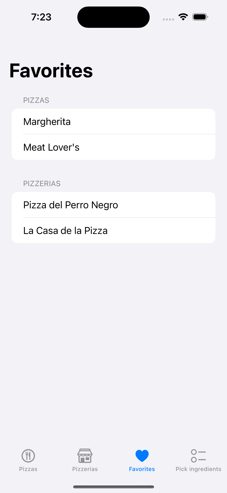
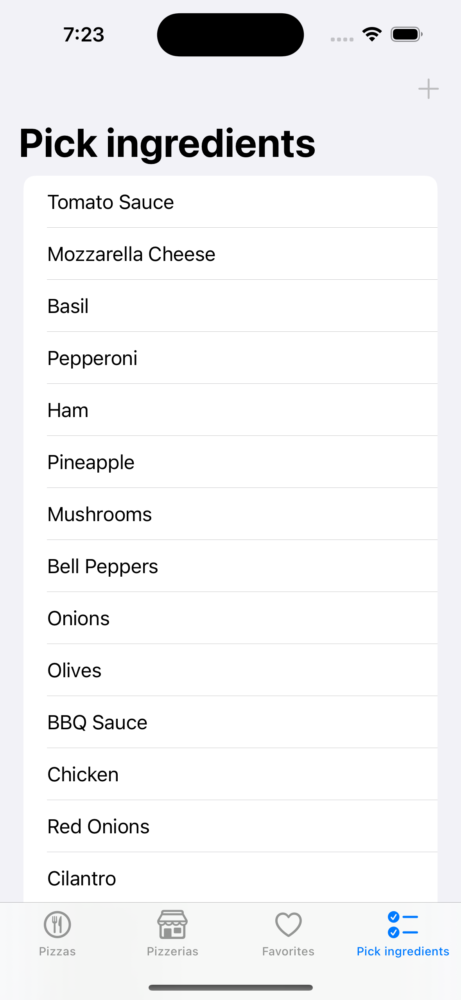

# 🍕 PizzaPlaneta

**PizzaPlaneta** is a delightful iOS app made for pizza lovers! Discover unique pizzas and explore local pizzerias, all in one app. Enjoy rich animations, interactive maps, and personalized favorites.

## 📱 App Structure

PizzaPlaneta is organized using a **Tab Bar** interface with the following sections:

1. **🍕 Pizzas** – View all available pizzas, explore ingredients with animations, and mark your favorites.
2. **🏬 Pizzerias** – Discover a curated list of predefined pizzerias, each with its location on a map.
3. **⭐ Favorites** – Access your saved pizzas and pizzerias in one place.
4. **👨‍🍳 Create Pizza** – Build your own pizza by selecting ingredients and watching it come to life with animations.

## 🗺️ Technologies Used

- **Swift & UIKit**
- **MVVM Architecture**
- **Lottie** for smooth and expressive animations
- **MapKit** to display pizzeria locations
- **JSON File** for storing favorites

## 📸 Preview

### A list of available pizzas

<p align="center">
  
  
</p>

### Explore preloaded pizzerias with location

<p align="center">
  
  
</p>

### Manage favorite pizzas and pizzerias

<p align="center">
  
</p>

### Build your own pizza

<p align="center">
  
</p>

## 🚀 Getting Started

1. Clone the repo:
   ```bash
   git clone https://github.com/yisslu/PizzaPlaneta.git
2. Open in XCode:
   ```bash
   open PizzaPlaneta.xcodeproj
3. Build and run on your device or simulator.
